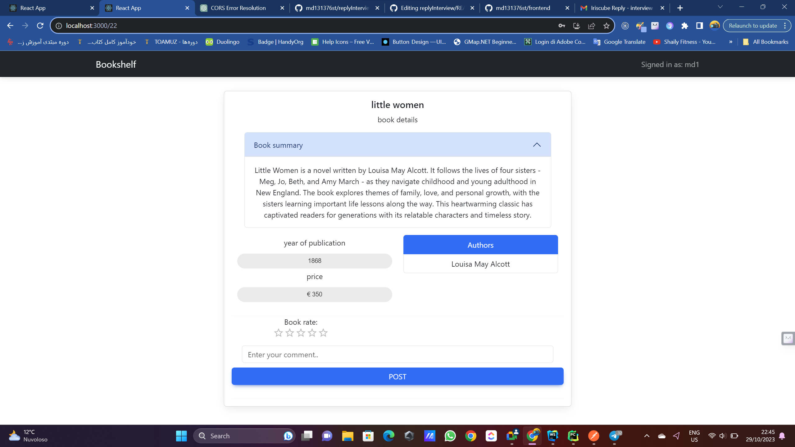
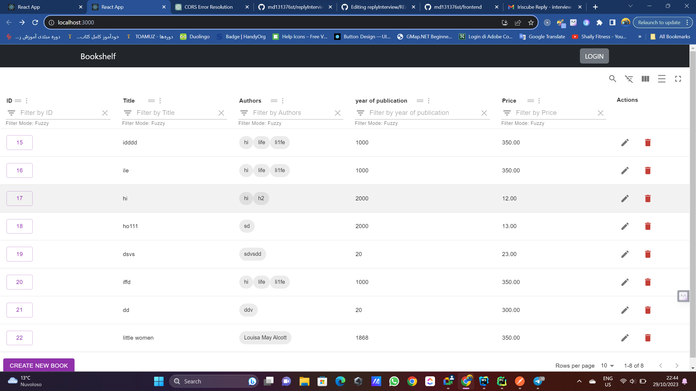

# Bookstore Web Application

Welcome to the Bookstore Web Application, a simple web-based system that allows users to browse, manage, and review books in the inventory.

## Table of Contents

- [Overview](#overview)
- [Features](#features)
- [Database](#database)
- [Backend](#backend)
- [Frontend](#frontend)
- [Usage](#usage)
- [Contributing](#contributing)

## Overview

The Bookstore Web Application is designed to provide a user-friendly interface for interacting with a bookstore's inventory. It includes features such as viewing books, adding new books, editing book information, and deleting books. Additionally, users can filter and sort books based on various criteria, view detailed information for each book, and leave reviews and ratings .

## Features

- **Viewing Books :** Users can see all available books in the inventory, fetched from the database and displayed in a user-friendly table or tab layout.

- **Create a New Book :** Users can add new books to the inventory by filling out a form. The information is sent to the server through a POST request and stored in the database.

- **Edit Book Information :** Users can update the details of existing books. A PUT request is used to send changes to the server, which then updates the database.

- **Delete a Book :** Users have the ability to remove a book from the inventory using a DELETE request to the server.

- **Filter Books :** Users can filter books based on various criteria, such as author, title, or year of publication. Both the frontend and backend support this functionality.

- **Sort Books :** Users can sort books based on different attributes, like price or year published. Similar to filtering, this feature is supported by both the frontend and backend.

- **Book Details Page :** Clicking on a book provides users with additional details about the book, with this feature requiring additional API support from the backend.

- **User Account Creation:** In the future, users may be able to create accounts to store their favorite books, write reviews, and more.

- **Review/Rating System ):** Users with accounts can leave reviews and ratings for books.

## Database

The application relies on a database to store information about books in the inventory. The database includes the following attributes for each book:

- ID
- Title
- Author
- Year of Publication
- Price

## Backend

The application's backend is responsible for providing a RESTful API to perform CRUD operations on books.

The backend includes the following APIs:

- Create a new book (POST)
- Retrieve a list of available books (GET)
- Update book information (PUT)
- Delete a book from the inventory (DELETE)
- Filter books based on criteria
- Sort books by various attributes
- Provide book details
- User account creation 
- Review and rating system 

## Frontend

The frontend of the application is built using React Framework. The user interface (UI) displays all the books from the database in a table or tabular format. Users can interact with the frontend to view, add, edit, and delete books. The UI also supports filtering, sorting, and providing additional details about each book.
[Forntend code reposotory](https://github.com/md131376st/frontend)

## Usage

To use the Bookstore Web Application, follow these steps:

1. Open the application in your web browser.

2. Browse the available books in the inventory.

3. Add a new book by filling out the provided form.

4. Edit book information by selecting the book and making changes.

5. Delete a book by clicking the delete button.

6. Use the filtering and sorting options to find books based on criteria.

7. Click on a book to view detailed information.

8. Create a user account (if supported) to enjoy additional features.

9. Leave reviews and ratings for books (if supported).

## Contributing

If you would like to contribute to the Bookstore Web Application, please follow these guidelines:

1. Fork the repository on GitHub.

2. Create a new branch for your feature or bug fix.

3. Make your changes and test thoroughly.

4. Ensure your code follows best practices and maintainability.

5. Create a pull request to merge your changes into the main branch.

6. Provide a clear and detailed description of your changes.

7. Be prepared to discuss and revise your code as needed.

